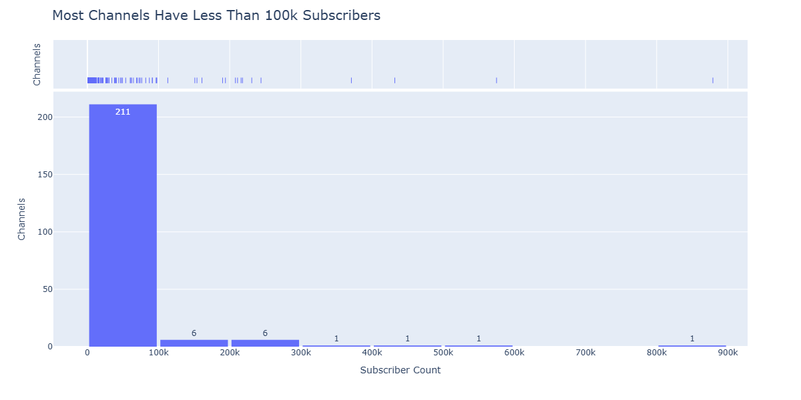

# Football Manager YouTube Video Analysis

Analysis of Football Manager (FM) YouTube content to understand trends, high-performing video categories, and viewership patterns using Python, Pandas, Seaborn, Plotly, Microsoft Excel, and DuckDB.

# Table of Contents

* [Project Summary](#project-summary) 
* [Background](#background)
* [Data Overview](#data-overview) 
* [Analytical Techniques](#analytical-techniques)
* [Tools and Technologies](#tools-and-technologies)
* [Methodology](#methodology)
* [Analysis Process](#analysis-process)
* [Insights and Findings](#insights-and-findings)
* [Next Steps](#next-steps)
* [Repository Structure](#repository-structure)

# Project Summary

This project analyzes Football Manager-related YouTube content, identifying key content categories, patterns in viewership trends, and correlations between video performance and metadata. The analysis leverages the [YouTube Data API](https://developers.google.com/youtube/v3/docs/search/list) to provide insights for content creators and businesses targeting the Football Manager audience, showcasing the dynamics of high-performing content and its evolution over time.

# Background

## The Football Manager Ecosystem
[Football Manager](https://en.wikipedia.org/wiki/Football_Manager) (FM) is a highly immersive football management simulation game that puts players in control of every aspect of their team, from tactical decisions to financial management. Available on all major gaming platforms, FM has cultivated a passionate global community, with over **7 million players** engaging with the latest release, Football Manager 2024. Central to this ecosystem are content creators on platforms like [YouTube](https://www.youtube.com/) and [Twitch](https://www.twitch.tv/), who not only entertain but also provide critical gameplay strategies, detailed tutorials, and creative challenges. By analyzing these creators and their content, this project uncovers actionable insights for growing and sustaining engagement in this dynamic ecosystem.

## The YouTube Platform for Football Manager Content 
[YouTube](https://www.youtube.com) serves not only as a hub for [Football Manager](https://en.wikipedia.org/wiki/Football_Manager) content, but also as a powerful marketing tool and search engine. For content creators, it offers a unique opportunity to engage with highly targeted audiences, build loyal communities, and generate sustainable revenue through ad monetization. Along with ad monetization, creators can leverage the YouTube platform to promote their brands on alternative platforms, such as [Patreon](https://www.patreon.com/) and [Twitch](https://www.twitch.tv/), directly sell their own merchandise, or earn brand sponsorship as well. 

YouTube’s algorithm, designed to surface relevant content to users based on viewing habits, makes it easier for creators to break into niches like Football Manager. Unlike traditional [SEO](https://en.wikipedia.org/wiki/Search_engine_optimization) strategies that rely heavily on written content and webpage optimization, YouTube offers the advantage of video durability—content created years ago can continue to generate views and engagement, long after initial publication.

This dynamic creates a highly competitive, yet accessible, space for creators of all sizes. Viewers use YouTube as a de facto search engine to find tutorials, gameplay strategies, and community-driven content. As a result, creators who understand how to optimize their video content can potentially gain significant visibility and reach. Furthermore, businesses targeting the Football Manager community can leverage YouTube’s ad platform to connect with a dedicated and engaged audience, fostering brand loyalty through authentic, creator-led partnerships.

For both creators and marketers, the insights from this project offer actionable strategies to capitalize on YouTube’s unique ecosystem. By identifying high-performing video categories and engagement patterns, this analysis provides a roadmap for content optimization and audience growth, ultimately reinforcing [YouTube](https://www.youtube.com)’s role as a cornerstone of the Football Manager content landscape.

# Data Overview

Primary data sources:

* The [YouTube Data API](https://developers.google.com/youtube/v3/docs/search/list) provided metadata, performance metrics, and channel details for hundreds of creators and thousands of FM-related videos. 

* Data was processed and stored in [DuckDB](https://duckdb.org/) for efficient querying and manipulation.

* Key metrics were exported to CSV and analyzed in  [Microsoft Excel](https://microsoft.com/en-us/microsoft-365/excel) using Pivot Tables and area charts to categorize content and track trends.

# Analytical Techniques

## Data Cleaning and Processing

To ensure data consistency, columns with inconsistent capitalization, special characters, or missing values were cleaned. Descriptive statistics and exploratory analysis were conducted to summarize the data.

## Categorization

Videos were categorized based on their title and description. Word frequency analysis and clustering techniques helped reveal trends and associations in content. Categories include:

* Challenges
* Experiments
* Rebuilds and Team Development
* Player Development
* Guides and Tutorials
* Community Collaborations
* Discussion

## Correlation Analysis

[Pearson’s Correlation Coefficient](https://en.wikipedia.org/wiki/Pearson_correlation_coefficient) was used to analyze relationships between view counts, like counts, comment counts, and other metrics.

## Time Series Analysis

Video viewership patterns were analyzed over time, with specific attention to periods of increased engagement, such as the months surrounding new FM releases.

# Tools and Technologies

## Data Collection and Storage
- **YouTube Data API**: For fetching video metadata and engagement metrics.
- **DuckDB**: For SQL-based data querying of dataframes and local database storage.
- **Selenium**: Automated browser interactions to simulate user scrolling and dynamically load video lists.
- **Chrome WebDriver**: A tool for controlling Chrome browser sessions programmatically.

## Data Analysis and Processing
- **Python**: Programming language used for API data extraction, data manipulation, and analysis.
  - **pandas**: Data cleaning, transformation, and analysis.
  - **NumPy**: Numerical operations and efficient data handling.
  - **re**: Text processing with regular expressions.
  - **NLTK**: Text processing and stopword removal.
  - **func_timeout**: Managing long-running web scraping activity with timeouts.
  - **datetime**: Handling and formatting timestamps.
  - **langdetect**: Language detection library to detect creator language.

## Data Visualization
- **matplotlib**: Static plot creation.
- **seaborn**: Pairplots, scatterplots, barplots, and other visualizations.
- **Plotly**: Interactive visualizations (e.g., stacked bar plots, scatter plots).
- **WordCloud**: Wordcloud generation from text data.
- **Pivot Tables**: Aggregations of groups of individual data within one or more discrete categories.
- **Area Charts**: Graphic display of quantitative data.

## Workflow and Environment
- **Jupyter Notebooks**: Organization and documentation of data analysis and visualization efforts.
- **Anaconda**: Python development environment and dependencies.
- **Microsoft Excel**: Spreadsheet editor.

# Methodology

This section outlines the steps taken to collect, process, and analyze the data in this project. The methodology follows a structured approach, ensuring clarity, reproducibility, and alignment with data analysis best practices.

## 1. Define Project Objectives and Scope
The goal of this project was to analyze Football Manager (FM) YouTube content, identify key engagement patterns, and explore content trends to uncover actionable insights for creators and analysts. Unless otherwise specified, project scope is focused on monetizable YouTube channels associated with Football Manager-related content with the largest amount of channel subscribers, collecting data for these cannels, extracting engagement metrics, and implementing content categorization.

---

## 2. Data Collection
- **YouTube Data API Integration**:  
  The YouTube Data API was utilized to gather channel and video metadata. Search terms such as “FM24” and “Football Manager” were used to identify relevant content.
- **Web Scraping with Selenium and Chrome Webdriver**:  
  To bypass YouTube Data API quota limitations, Selenium was employed to extract video IDs directly from playlist URLs.
- **Data Persistence**:  
  All collected data was stored in DuckDB and CSV files for efficient querying and reproducibility.
- **Time Period**:  
  Data collected from the earliest dates available in the YouTube Data API until November 29, 2024.  

---

## 3. Data Cleaning and Preprocessing
- **Filtering Non-Relevant Channels**:  
  - Channels unrelated to Football Manager were excluded based on domain knowledge and keyword-based filtering.
  - Channels below monetization threshold of **1000** subscribers.
  - Channels autogenerated by the YouTube platform. Ex: [Football Manager 2024 - Topic](https://www.youtube.com/channel/UCQJrYbskjw0NTT0Wp9XSBXw)
- **Remove Duplicate Columns**
  - Remove dataframe columns storing same information. Ex: `description`  and `brandingDescription`, `channelTitle` and `brandingTitle`.
- **Confirm Numeric Fields are Valid**
  - `subscriberCount`
  - `viewCount`
  - `videoCount` 
- **Standardizing Keywords**:  
  Channel branding keywords were cleaned and transformed into lists to enable keyword-specific analysis.
- **Feature Engineering**:  
  Several new columns were created to enhance the dataset, including:
  - `numeric_duration` for video lengths in seconds.
  - `publish_day_name` for day-of-week analysis.
  - `LikeRatio` and `CommentRatio` to normalize engagement metrics.

---

## 4. Exploratory Data Analysis (EDA)
- **Summary Statistics**:  
  Descriptive statistics provided an overview of key metrics like subscribers, views, and likes.
- **Visualizations**:  
  Correlation heatmaps, histograms, scatterplots, and boxplots were used to reveal patterns and distributions in the data.
- **Correlation Analysis**:  
  Relationships between likes, views, comments, and video duration were analyzed using correlation coefficients.

---

## 5. Content Categorization and Trends Analysis
- **Primary and Secondary Categories**:  
  Videos were classified into categories such as “Challenges,” “Experiments,” and “Rebuilds” to uncover dominant themes.
- **Wordcloud Analysis**:  
  Video descriptions were aggregated and visualized to identify prominent terms and content trends.
- **Seasonality Analysis**:  
  Engagement patterns over time were analyzed, with a focus on the release cycles of Football Manager games and their impact on video performance.

---

## 6. Insights and Findings

- **Ecosystem**
  - **575** YouTube channels are produce Football Manager content, with **46%** eligible for the [YouTube Partner Program Eligibility](https://support.google.com/youtube/answer/72851?hl=en&ref_topic=9153642&sjid=13407352636801244061-NC) based on subscriber count.
  - A total of **7.49M** YouTube subscribers to channels related to Football Manager were found.
  - The oldest channel found producing Football Manager content was created in February 2007 ([docks](https://www.youtube.com/@JonaDocks)), yet the oldest verifiable Football Manager content video in our dataset was created in January 2013 (["Genie Scout 13 Tutorial - Intro" ](https://www.youtube.com/watch?v=gEqBRTVV2M4) by [FM Scout](https://www.youtube.com/@fmscout) ).
  - Subcriber distribution is highly skewed; small numbers of creators have significant subscriber amonuts, while larger numbers of creators have much smaller communities.
    | channelTitle   |   subscriberCount |
    |:---------------|------------------:|
    | NickRTFM       |            879000 |
    | Nick28T        |            575000 |
    | Domingo Replay |            432000 |
    | Zealand        |            371000 |
    | docks          |            244000 |
    | Ataberk Doğan  |            231000 |
    | Manny Plus     |            218000 |
    | Kırmızı Kep    |            216000 |
    | WorkTheSpace   |            211000 |
    | TomFM          |            208000 |
    | FM Scout       |            194000 |
    | lollujo        |            190000 |
    | ZackNaniTV     |            161000 |
    | DK FALCON      |            154000 |
    | Omega Luke     |            151000 |
    | DoctorBenjy FM |            113000 |
    | Seals 311      |             97600 |
    | Steini         |             97000 |
    | Arthur Ray     |             96600 |
    | Zealand Live   |             91300 |

    
    
    - Ranking YouTube channels by their number of subscribers, **62%** (**4.64M**) of subscribers are accounted for by the top **20%** of content creators.
    - The average number of subscriptions per channel is **33K**, while the median amount rests at **5670** subscriptions per channel. (**Note**:Channel subscriptions are _not_ exclusive on the YouTube platform; a viewer may subscribe to, and surface content from, one or more channels at any time and with any frequency).
  - Several larger content creators, ranked by subscriber count, have launched secondary and tertiary channels, increasing their overall subscription footprint:
    - [Zealand](https://www.youtube.com/@ZealandonYT)
    - [lollujo](https://www.youtube.com/@lollujo)
    - [Second Yellow Card](https://www.youtube.com/@Secondyellowcard)
  - **81%** of languages spoken in Football Manager-related channels are European.
      
    - English (en) is the spoken language in **50%** of all channels. 
    - Turkish (tr)is the second-most common language with **10.55%**. In third to sixth place:
      - Spanish (es): **6.88%**
      - Portuguese (pt): **6.42%**
      - French (fr): **4.13%**
      - German (de): **3.21%**
  - The non-European languages found in our dataset were:
    - Indonesian
    - Korean
    - Arabic
    - Japanese
  - **77%** of monetizable channels producing Football Manager content have branding keywords present. For channels using branding keywords, the average number of is **18.93**. 

- **Engagement Patterns**
  - **Likes**
    - A strong correlation exists between _likes_ and _views_, with a correlation coefficient of **0.82**. _Likes_ are a strong proxy measurement for _views_ as content consumers would likely need to view a video before determining it worthy of a _like_.
    
    - A modest correlation exists between _likes_ and _comments_, with a correlation coefficient of **0.67**. Commenters on a video would also need to view the video before investing effort to comment on a video

    
  - **Views**
    - A weaker correlation exists between _views_ and _comments_, with a correlation coefficient of **0.56**.
    
  - **Comments**
    - No correlation between running time for videos and the amount of comments.
    
  - **Running Time**
    - No clear relationships were found between video running time and the amount of _views_, _likes_,  and _comments_, with all computed correlation coefficients nearing 0. The Football Manager content audience has no preference in content length, leaving creators freedom to produce long-form or short-form content without impacting engagement.
    

- **Content Trends**
  - Prior to the `FM20` game release, rises in the maxiumum monthly YouTube views could occur before and after the game release date. After the `FM20` game release, maximum monthly views for Football Manager content consistently coincide with the same month as the FM release date. We postulate the following:
    -  The YouTube algorithm steadily improving notification and feed recommendation mechanisms, promoting Football Manager content at a cadence aligned with YouTube user search intent.
    - Content creators promoting and publishing content with adjusted lead times ahead of game release dates, capitalizing on YouTube search intent earlier than previous years.
    
    - In addition to the rise in _views_ proximate to the `FM20` game release in  **2019**, **2020** proper saw an increase in YouTube channels creating Football Manager content by **126.32%**. COVID-19 pandemic restrictions, employment changes, and shifting patterns of social activity may have enabled new sets of creators and audiences open to their content offerings.   
    - In spite of the stark increase in raw _views_ volume with the `FM20` Game Release, the percent change in _views_ has trended downward over the past decade. This decrease could have several causes:
      * Market saturation
      * Dominance of larger subscribed creators
      * YouTube algorithmic shifts presenting less viable results
      * Competition from emerging content and streaming platforms 
    
  - **Seasonality**
    - **October** is the month usually associated with monthly maximum _views_. **November** is month usually associated with monthly maximum _comments_. **November** is the common release date for new version of Football Manager. For _comments_, this time of the year may provide time for viewers to engage content, discuss their newly acquired game purchases, and share their playing experiences.
    - **Days of the Week**
      - All dates, days, and times are in [UTC](https://en.wikipedia.org/wiki/Coordinated_Universal_Time). 
        - **Thursday** and **Wednesday** are the most popular days for content creators to publish content.
        - **Thursday** and **Monday** are the most popular days for viewers to watch FM content.
        - **Monday** and **Thursday** are the most popular days for viewers to comment on content.
  - **Popular Content and Creators**
    - **Views**
      - **Top 10 Most Viewed Videos**

        | channelTitle   |        viewCount | url                                         |   year |
        |:---------------|-----------------:|:--------------------------------------------|-------:|
        | TomFM          |      1393911 | https://www.youtube.com/watch?v=CtIN34WbVJ0 |   2024 |
        | DoctorBenjy FM | 923621           | https://www.youtube.com/watch?v=_rWxg3CEHcY |   2015 |
        | TomFM          | 817896           | https://www.youtube.com/watch?v=9ialQPtqTnc |   2023 |
        | TomFM          | 656077           | https://www.youtube.com/watch?v=W2oF7EINGjE |   2023 |
        | Omega Luke     | 598924           | https://www.youtube.com/watch?v=pPKvlyaeHYc |   2023 |
        | Zealand        | 591198           | https://www.youtube.com/watch?v=16MSX9-0VyY |   2024 |
        | Zealand        | 535323           | https://www.youtube.com/watch?v=e_HSqKXz2HY |   2023 |
        | Zealand        | 525820           | https://www.youtube.com/watch?v=MXDMoNOZu-I |   2022 |
        | Zealand        | 521730           | https://www.youtube.com/watch?v=Psf-WyPNlSA |   2021 |
        | Omega Luke     | 521595           | https://www.youtube.com/watch?v=IIN3FHShc44 |   2023 |
      
      - [Zealand](https://www.youtube.com/@ZealandonYT) created **50%** of all top 50 videos ranked by _views_, with [TomFM](https://www.youtube.com/@TomFM) and [Omega Luke](https://www.youtube.com/@OmegaLukeGaming) rounding out the top three.
      - **Video Categories**
        - From the Top 50 videos ranked by views, we generated a list of categories to classify videos based on the purpose or niche.
        - Categories
          - Guides and Tutorials             
          - Challenges                       
          - Experiments                      
          - Player Development                
          - Rebuilds and Team Development     
          - Gameplay Walkthroughs             
          - Community Collaborations
      - **Category Trends**
        
        - **2015** to **2020**, "Experiments" and "Player Development" are the only categories seen in our top viewed videos. 
        - "Experiments" reach their peak in **2024** and are present in five out of the eight years in this dataset,  suggests early YouTube audiences were already familiar with Football Manager or the real-life game in general.
        - The "Player Development" category dominance in **2018** and **2020** speaks to viewers who seeking targeted gameplay advice.
        - **2021** marks the general spread of categories for most viewed videos. This categorical spread may be the result from the sharp uptick in view volume observed in late **2020** coupled with an influx of new or returning player communities.- "Rebuilds" are present every year from **2021 onwards**, though their volume never rises greater than two videos in any individual year.
        - From **2022** to **2024** the "Challenges" category emerges, with their peak in 2023. "Challenges" imply a lack of novelty or dearth of interesting gameplay features.
        - "Community Collaborations" are only present in two years of our dataset. This niche may have untapped potential for content creation.
      - **Wordcloud Summary from Top Viewed Videos**
        - We generated [wordclouds](https://en.wikipedia.org/wiki/Tag_cloud) to measure the frequency and use of terms in the "description" field for top ranked videos by _views_. An example using [DoctorBenjy FM](https://www.youtube.com/c/DoctorBenjyFM):
        
        - **Cursory Channel Brand Summaries**
          - **DoctorBenjy FM**: Targets experienced FM players seeking extreme gameplay experiments.
          - **Domingo Replay**: Variety streamer persona.
          - **FM Scout**: Community site with assets, resources, and guides to finding Wonderkids
          - **lollujo**: Daily content creator, but the 30 year simulation experiments contrasts with usual content.
          - **Omega Luke**: Focuses on challenges and rebuilds. 
          - **TomFM**: All-rounder, with even content distribution, less so for “Player Development” genre.
          - **WorkTheSpace**:  All-rounder with broad audience appeal.
          - **Zealand**: Tutorial-focused, catering to newer and casual players. Leader in the Community Collaboration genre.
    - **Comments**
      - Videos in top 50 ranked by comment count have an average **1003** comments.
      - Approximately **75%** of videos with the highest amount of comments have less than **1000** comments in total.
      - **lollujo** and **WorkTheSpace** feature more prominently in the top 50 _most commented on_ videos compared to _most viewed_ videos. This reveals these creators’ communities exhibit different viewing behavior patterns than other channels, implying steeper amounts of intellectual and emotional investment. In different YouTube domains we have analyzed, _comments_ and _views_ have a generalized inverse relationship. Viral content garnering large amounts of _views_, more "niche" content gaining loyal, but smaller engagement associated with _comments_. The appearance of these two creators may be indicative of the latter audience type, even though the pairplots show no direct indication of the inverse relationship between _comments_ and _views_.
      - There is only **12%** overlap between highly viewed and highly commented videos, reaffirming the previously mentioned inverse relationship between _likes_ and _comments_. Four of these videos fall in the “Experiments” category, the remaining two related to [NewgeN facepack installation process](https://www.youtube.com/watch?v=pmdIkhfmY6w) and the other covering the creator’s [first FM24 rebuild](https://www.youtube.com/watch?v=0u0IVpGsork). "Experiments" may be an underappreciated niche for heightened comment and view counts.
    - **Fastest Growing Creators by Subscribers**

      | channelName    |   subscribers |   subs_per_day |
      |:---------------|--------------:|---------------:|
      | Domingo Replay |        432000 |       157.205  |
      | Manny Plus     |        218000 |       144.085  |
      | Ataberk Doğan  |        233000 |       119.06   |
      | Zealand        |        372000 |        76.4174 |
      | Omega Luke     |        151000 |        74.6047 |
      | TomFM          |        209000 |        72.8731 |
      | Kırmızı Kep    |        217000 |        59.1764 |
      | lollujo        |        190000 |        57.1772 |
      | ZackNaniTV     |        161000 |        51.7851 |
      | WorkTheSpace   |        212000 |        48.9947 |
      | FM Scout       |        194000 |        39.319  |
      | docks          |        244000 |        37.6427 |
      | Zealand Live   |         91400 |        37.6287 |
      | Steini         |         97100 |        33.9036 |
      | DoctorBenjy FM |        113000 |        30.0372 |
      | Arthur Ray     |         96800 |        27.5235 |
      | Seals 311      |         97600 |        17.1892 |
      - The fastest growing channels are dominated by content creators that overlap with **FIFA/FC24** content creators and variety streamers with a large gaming catalogs. Using different content niches may expand a content creator's audience, growing their channels and attracting subscribers with  diverse appetites.
    - **Most Efficient Videos**
      - We define "efficiency" as videos gaining the highest engagement metric per 1000 _views_ .
      - **LikeRatio**

        | channelTitle   |   LikeRatio | url                                         | publishedAt               |
        |:---------------|------------:|:--------------------------------------------|:--------------------------|
        | lollujo        |     219.915 | https://www.youtube.com/watch?v=lkJ-0EumbHM | 2020-07-10 08:00:23-07:00 |
        | Omega Luke     |     212.264 | https://www.youtube.com/watch?v=h604OlgwLlg | 2020-07-27 04:00:13-07:00 |
        | DoctorBenjy FM |     192.223 | https://www.youtube.com/watch?v=volTKpFVvZ4 | 2021-09-20 09:00:23-07:00 |
        | lollujo        |     181.957 | https://www.youtube.com/watch?v=DjJAVtVGacg | 2021-04-05 08:00:13-07:00 |
        | Kırmızı Kep    |     181.609 | https://www.youtube.com/watch?v=SZ4w62mrb6o | 2024-12-05 06:55:40-08:00 |
        | lollujo        |     177.163 | https://www.youtube.com/watch?v=J7pA2tdB5Qw | 2020-01-13 08:00:03-08:00 |
        | DoctorBenjy FM |     176.413 | https://www.youtube.com/watch?v=AwepnGwmrpk | 2020-06-05 09:00:05-07:00 |
        | DoctorBenjy FM |     175.517 | https://www.youtube.com/watch?v=h5WmgiyLWNk | 2017-05-19 09:00:06-07:00 |
        | Ataberk Doğan  |     173.365 | https://www.youtube.com/watch?v=_7dRkUkAUdA | 2022-10-14 07:01:13-07:00 |
        | WorkTheSpace   |     173.304 | https://www.youtube.com/watch?v=9LAmpVCsrlo | 2023-04-25 04:00:09-07:00 |
        | DoctorBenjy FM |     172.101 | https://www.youtube.com/watch?v=uSkamfVssUA | 2019-01-06 10:00:05-08:00 |
        | lollujo        |     169.017 | https://www.youtube.com/watch?v=GBbP1DaBRIg | 2020-05-15 08:00:11-07:00 |
        | docks          |     168.918 | https://www.youtube.com/watch?v=CLfRDtePHOQ | 2013-10-19 02:00:00-07:00 |
        | Kırmızı Kep    |     168.507 | https://www.youtube.com/watch?v=3bo66nME7gY | 2024-12-03 13:30:07-08:00 |
        | Ataberk Doğan  |     167.237 | https://www.youtube.com/watch?v=2Xw__W_Sn5k | 2022-08-19 07:00:02-07:00 |
        | docks          |     165.674 | https://www.youtube.com/watch?v=jyMOOgqyxwc | 2013-08-03 02:30:10-07:00 |
        | Ataberk Doğan  |     164.627 | https://www.youtube.com/watch?v=AWn7RQ2oZW4 | 2022-09-09 07:00:10-07:00 |
        | docks          |     162.812 | https://www.youtube.com/watch?v=vqA4Isi8tt4 | 2014-02-22 02:00:00-08:00 |
        | Ataberk Doğan  |     162.709 | https://www.youtube.com/watch?v=1mDCqJDArEY | 2022-08-12 07:00:01-07:00 |
        | docks          |     161.392 | https://www.youtube.com/watch?v=1idmHQSajvQ | 2014-03-09 04:00:00-07:00 |
      - **CommentRatio** 

          | channelTitle   |   CommentRatio | url                                         | publishedAt               |
          |:---------------|---------------:|:--------------------------------------------|:--------------------------|
          | Kırmızı Kep    |       137.11   | https://www.youtube.com/watch?v=-IDzMmG-0fw | 2020-04-26 09:51:05-07:00 |
          | WorkTheSpace   |       132.653  | https://www.youtube.com/watch?v=QdauHlWeb_E | 2013-09-12 04:20:07-07:00 |
          | TomFM          |       117.117  | https://www.youtube.com/watch?v=Xx-ijzyInvI | 2017-12-23 10:00:03-08:00 |
          | Kırmızı Kep    |       107.567  | https://www.youtube.com/watch?v=W13gZVEAA4U | 2015-07-21 01:23:33-07:00 |
          | Kırmızı Kep    |        83.6013 | https://www.youtube.com/watch?v=GBz9j20YH1A | 2015-01-30 06:09:39-08:00 |
          | Kırmızı Kep    |        80.3882 | https://www.youtube.com/watch?v=9srmD7JdDGs | 2020-04-28 10:05:06-07:00 |
          | FM Scout       |        74.5856 | https://www.youtube.com/watch?v=YtzdRihl-84 | 2015-12-17 11:08:44-08:00 |
          | Omega Luke     |        73.1132 | https://www.youtube.com/watch?v=h604OlgwLlg | 2020-07-27 04:00:13-07:00 |
          | docks          |        70.5834 | https://www.youtube.com/watch?v=YmKRvrOJjWI | 2013-12-09 08:00:01-08:00 |
          | docks          |        69.0205 | https://www.youtube.com/watch?v=Tej7awsFsO8 | 2013-06-25 07:30:45-07:00 |
          | Steini         |        61.6045 | https://www.youtube.com/watch?v=soMphEZ7hAg | 2021-02-11 07:00:14-08:00 |
          | DoctorBenjy FM |        60.6061 | https://www.youtube.com/watch?v=lE8W52FsqLo | 2014-10-20 05:41:42-07:00 |
          | WorkTheSpace   |        59.5472 | https://www.youtube.com/watch?v=iA5kYOOxJww | 2015-04-15 07:17:30-07:00 |
          | TomFM          |        59.0631 | https://www.youtube.com/watch?v=t3AcrP6_G5w | 2018-04-08 06:00:10-07:00 |
          | TomFM          |        58.8235 | https://www.youtube.com/watch?v=1z3KXrKI4yc | 2017-01-20 08:00:00-08:00 |
          | docks          |        56.2064 | https://www.youtube.com/watch?v=hB3_-33tHMU | 2013-07-19 07:30:11-07:00 |
          | Kırmızı Kep    |        54.7132 | https://www.youtube.com/watch?v=61sQrSDeo7s | 2015-01-27 04:02:44-08:00 |
          | DoctorBenjy FM |        54.2768 | https://www.youtube.com/watch?v=Eq7Spn0sXnc | 2017-11-17 09:00:02-08:00 |
          | Omega Luke     |        53.1915 | https://www.youtube.com/watch?v=ccdiGpfdH2Q | 2020-07-05 04:00:18-07:00 |
          | Kırmızı Kep    |        52.8207 | https://www.youtube.com/watch?v=hlxPGJwHGfw | 2015-02-18 07:52:07-08:00 |

---
## 7. Next Steps
---

# Repository Structure
* `data/`: Contains raw YouTube video data and spreadsheets.
* `notebooks/`: Jupyter notebooks with all analysis and code.
* `images/`: Visualization outputs used in this README.md.
* `README.md`: This document.
